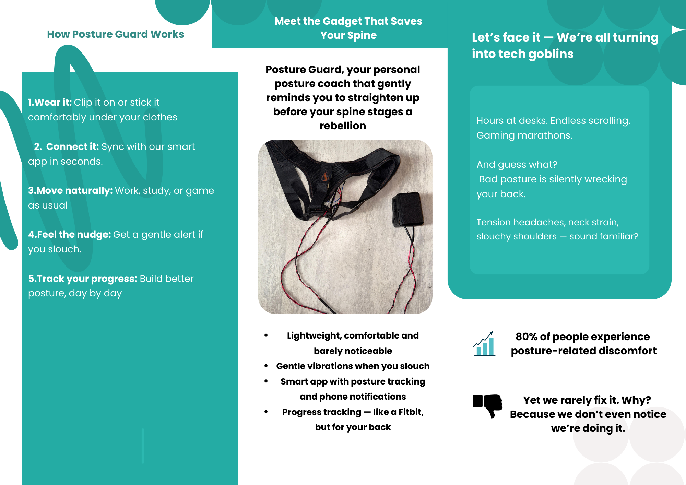

# Posture-Guard
PostureGuard is an smart, wearable posture monitoring system designed to promote better musculoskeletal health during prolonged sitting activities.

The device tracks the user’s sitting posture in real time and provides haptic feedback and app-based alerts whenever slouching is detected — encouraging healthier screen habits and helping to reduce the risk of back and neck pain.

Coupled with our custom-built PostureGuard mobile app, users can monitor posture trends, receive personalized exercise recommendations, and track daily progress through a clean, user-friendly interface.

